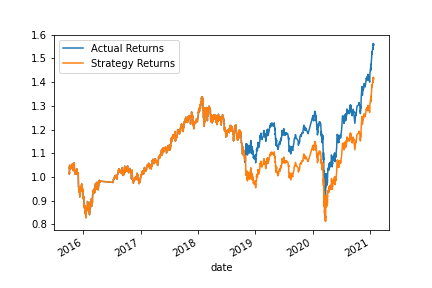

# Module_14_Challenge - Machine Learning Trading Bot

This exercise on building Deep Learning Trading Bots demonstrates usage of the StandardScalar, and test_train_split packages within scikit-learn. These packages paired with the DateOffset Pandas Time Series packages within Tensorflow allow one to design a neural network from reduced data and analyze the model's efficacy. This could be due to the use of the 'relu' function for the output layer. However, every attempt at using the 'sigmoid' function was unsuccessful. With more time, I would investigate this issue further. 

---

## Discussion

### The Baseline chart


### What impact resulted from increasing or decreasing the training window?

6 month time slice had better recall for 1.0 than 3 months. The strategy returns projected higher than actual returns. 

### What impact resulted from increasing or decreasing either or both of the SMA windows?

using a short window of 10 days and a long window of 100 days drew the final results in 2021 back together when included with the 6 month time slice. 



---

## Technologies

This project leverages python 3.10 with the following packages:

* [pandas](https://github.com/pandas-dev/pandas) - For available packages within pandas.

* [tensorflow](https://www.tensorflow.org/api_docs/python/tf) - For available packages within tensorflow.

* [tf.keras](https://www.tensorflow.org/api_docs/python/tf/keras) - For available packages within tf.keras.

* [pathlib](https://github.com/matplotlib/matplotlib) - For available packages within matplotlib.

* [sklearn](https://scikit-learn.org/stable/) - For available packages within sklearn.

* [jupyterlab](https://github.com/jupyterlab/jupyterlab) - For packages within jupyter lab.

---

## Installation Guide

This application requires you first install the following dependencies to run correctly.

```python
  pip install pandas
  pip install scikit-learn
  pip install --upgrade tensorflow
```

```jupyter lab
  conda install jupyterlab
```

---

## Usage

To use the crypto investments tool simply clone the repository and run the **crypto_investments.ipynb** with:

```jupyterlab
python venture_funding_with_deep_learning.ipynb
```

Upon launching the Deep Learning notebook, you can see the reduction of the original data, and how it is manipulated to fit a keras model.

---

## Contributors

***Brought to you by World Reknowned Financial Advising Team at LeSieur Financial***

---

## License

### *LICENSE PENDING*